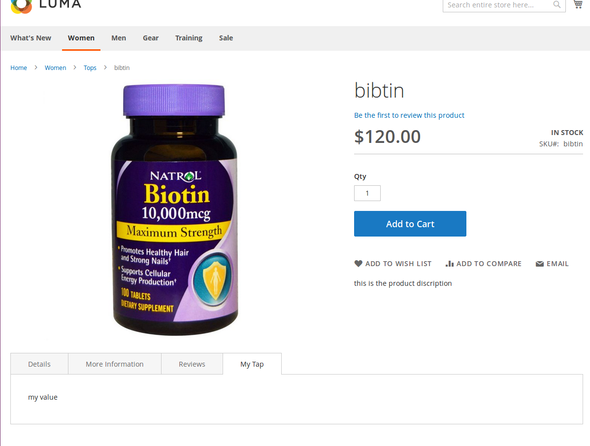
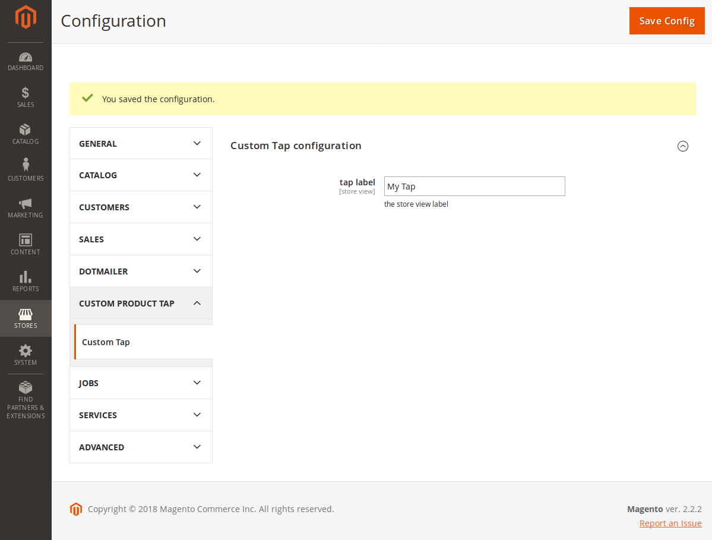
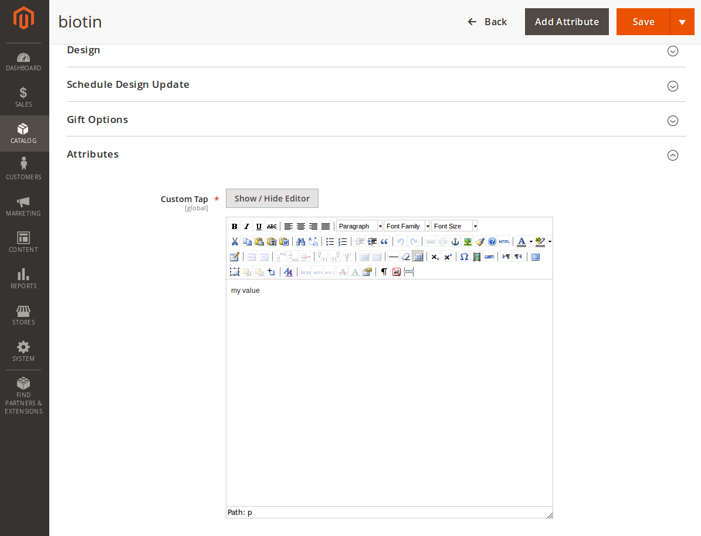

Synopsis:

Our Likes Extension for Magento2 is simple and very useful.
That allow you to add your own tap in product page next to Reviews, Details and More Informations. 

Features:

If You have in a certain situation an important product attribute,
or whatever attribute that a product specialized with and you would rather to put it (as a tap)next to Reviews,
so the customer would see it directly.

You can set the store view label for the tap.
Just go to Stores->Configuration->CUSTOM PRODUCT TAP->Custom Tap

To put the value of that custom tap(attribute).
You will find it in Attributes group when you are adding 
a new product or editing a product.

Note:
If you don't set a value for the tap it doesn't show up in product page (frontend).
Module namespace directory must be NovaMinds.
Our extention add the Customattribute(custom attribute)
to the Default attribute set, if your product has a deffirent attribute set 
that doesn't based on the Default attribute set, then you will have to add
Customattribute to the product attribute set

If you face any problem, please tell us.

Installation:

To install our extension just put it in app/code/NovaMinds directory, 
cd to your magento2 root directory and run magento command: 
php bin/magento setup:upgrade

License:

Open Source

